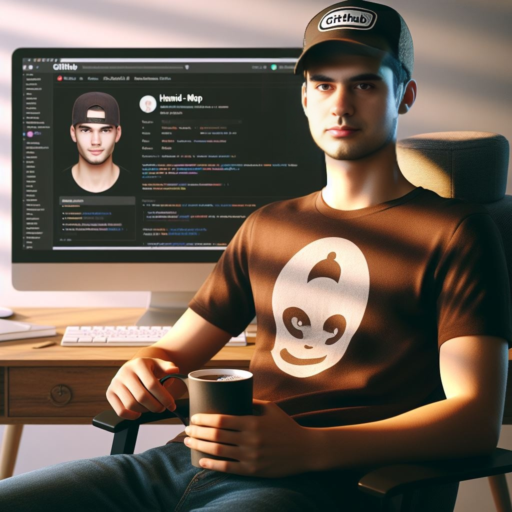

## &nbsp;Hello! 

- 🔭 I'm currently working at RCDAT and Vafatech
- 🌱 I'm currently learning NoSQL, Deep Learning
- 🥅 Goals: Explore more things about DBMS, Statistics, Devops and etc.
- ⚡ Hobbies: Stay updated, reading, playing games, watching movies
- 📫 How to reach me: 

<!-- **Support my work on:**

 -->

## 🛠 &nbsp;Tech Stack

| Development| Data| Machine Learning| Web| DevOps 
|----- | ----- | ------ | ------ | ------ |
|||||| 

<!-- ## &#x1f4c8; Github Stats -->

<!-- 
  
 -->

<!-- 

-->
<!-- Featured Projects -->

<!-- 
 -->
